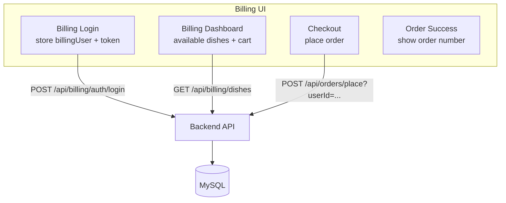
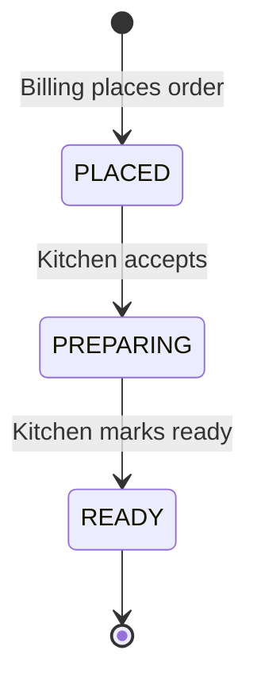
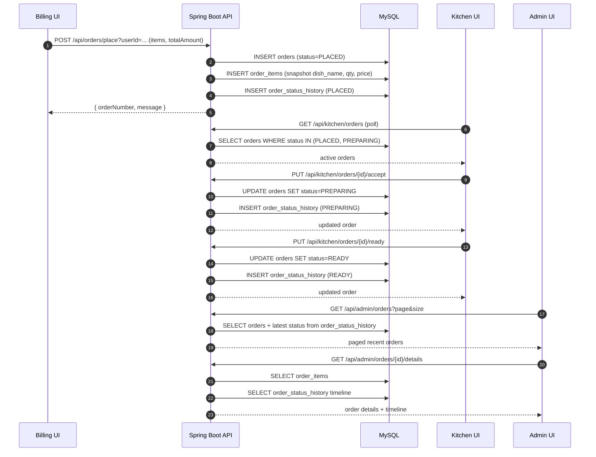
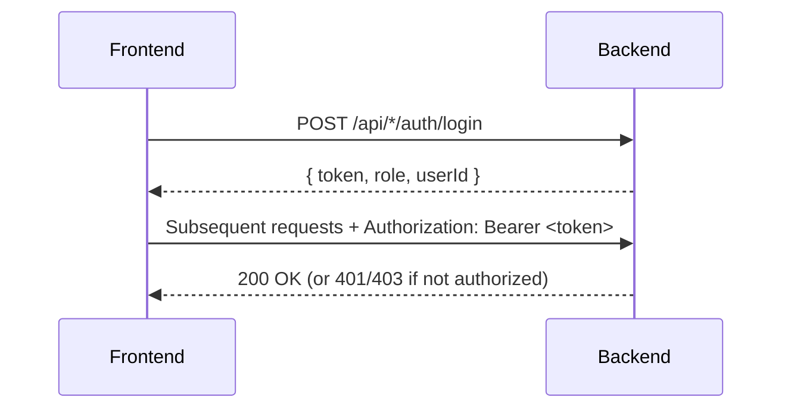

# Project Architecture (Visual Flow)

This document provides a visual, end-to-end view of how data flows through the BurgerKing Restaurant Management System and how that data is rendered in the frontend portals.

## High-Level System View

```mermaid
flowchart LR
  subgraph FE[Frontend (React + Vite) - http://localhost:5173]
    A1[Admin Portal\n/admin]
    B1[Billing Portal\n/billing]
    K1[Kitchen Dashboard\n/kitchen]
  end

  subgraph BE[Backend (Spring Boot REST API) - http://localhost:8080]
    C1[Controllers\n/api/**]
    S1[Services\n(Business Logic)]
    R1[Repositories\n(Spring Data JPA)]
  end

  subgraph DB[MySQL Database\n(burgerking_db)]
    T1[(users, roles)]
    T2[(dishes, dish_images)]
    T3[(orders, order_items, order_status_history)]
  end

  subgraph FS[File Storage]
    U1[(uploads/)]
  end

  A1 -->|Axios: /api/admin/*| C1
  B1 -->|Fetch: /api/billing/*, /api/orders/*| C1
  K1 -->|Fetch: /api/kitchen/*| C1

  C1 --> S1 --> R1 --> DB

  A1 -->|Dish image upload| C1
  C1 -->|Write file| U1
  U1 -->|Serve static /uploads/**| A1
  U1 -->|Serve static /uploads/**| B1
```

## Backend Layering (How a Request is Handled)

```mermaid
flowchart TB
  UI[React UI] -->|HTTP request| CTRL[Controller\n(com.burgerking.*.controller)]
  CTRL -->|calls| SRV[Service\n(com.burgerking.*.service)]
  SRV -->|reads/writes| REPO[Repository\n(com.burgerking.*.repository)]
  REPO -->|JPA/Hibernate| MYSQL[(MySQL)]
  SRV -->|response DTOs| CTRL -->|JSON| UI
```

## Frontend Routing (What the User Sees)

```mermaid
flowchart LR
  R[React Router] --> W[/ / Welcome]
  R --> REG[/register / Register]
  R --> L[/login / Admin Login]
  R --> A[/admin / Admin Layout]
  R --> BP[/billing / Billing Welcome]
  R --> BL[/billing/login / Billing Login]
  R --> BD[/billing/dashboard / Billing Dashboard]
  R --> BC[/billing/checkout / Checkout]
  R --> BS[/billing/order-success / Success]
  R --> K[/kitchen / Kitchen Dashboard]

  A --> AD[Dashboard]
  A --> AO[Orders]
  A --> AM[Manage Staff]
  A --> DI[Dishes]
```

## Portal Data Flows (What Data is Fetched and Where it is Shown)

### Admin Portal

```mermaid
flowchart TB
  subgraph AdminUI[Admin UI]
    A1[Admin Dashboard\nKPIs widgets]
    A2[Orders Page\nRecent list + Details drawer]
    A3[Dishes Page\nList + Add/Edit/Delete]
    A4[Staff Page\nUsers CRUD + Toggle]
  end

  A1 -->|GET /api/admin/dashboard/kpis| API
  A2 -->|GET /api/admin/orders?page&size| API
  A2 -->|GET /api/admin/orders/{id}/details| API
  A3 -->|GET /api/admin/dishes| API
  A3 -->|POST /api/admin/dishes (multipart)| API
  A3 -->|PATCH availability/pricing/discount| API
  A3 -->|DELETE /api/admin/dishes/{id}| API
  A4 -->|GET /api/admin/users| API
  A4 -->|POST/PUT/PATCH/DELETE /api/admin/users| API

  API[Backend API] --> DB[(MySQL)]
  API --> UP[(uploads/)]
```

What the Admin UI renders:

- KPIs are derived from counts/sums in MySQL (orders today, dishes counts, staff counts).
- Order list is a paged dataset with the latest status computed from `order_status_history`.
- Order details drawer pulls items from `order_items` and timeline from `order_status_history`.
- Dishes list is built from `dishes` plus optional image URLs from `dish_images`.

### Billing Portal



What the Billing UI renders:

- Dish cards come from `GET /api/billing/dishes` (only available dishes).
- Cart is stored client-side (localStorage) and used to build the order request payload.
- On success, the UI displays the returned `orderNumber`.

### Kitchen Dashboard

```mermaid
flowchart TB
  subgraph KitchenUI[Kitchen UI]
    K1[Kitchen Dashboard\nPolling every 5s]
    K2[Order Card\nAccept / Done actions]
  end

  K1 -->|GET /api/kitchen/orders| API
  K2 -->|PUT /api/kitchen/orders/{id}/accept| API
  K2 -->|PUT /api/kitchen/orders/{id}/ready| API

  API[Backend API] --> DB[(MySQL)]
```

What the Kitchen UI renders:

- Two lanes: `PLACED` (New Orders) and `PREPARING` (Cooking).
- Items are currently returned for `PREPARING` orders (and empty for `PLACED`).

## Order Lifecycle (State Machine)



Data written per transition:

- `orders.status` is updated to current state.
- A new row is appended to `order_status_history` (timeline source for Admin).

## End-to-End Order Sequence (Billing -> Kitchen -> Admin)



## Authentication Flow (Current vs Intended)

Current state:

- Spring Security is configured to allow all requests (`permitAll()`), so the UI can call APIs without tokens.
- Billing login returns a JWT token; Admin login does not currently return a token.

Intended production flow:


